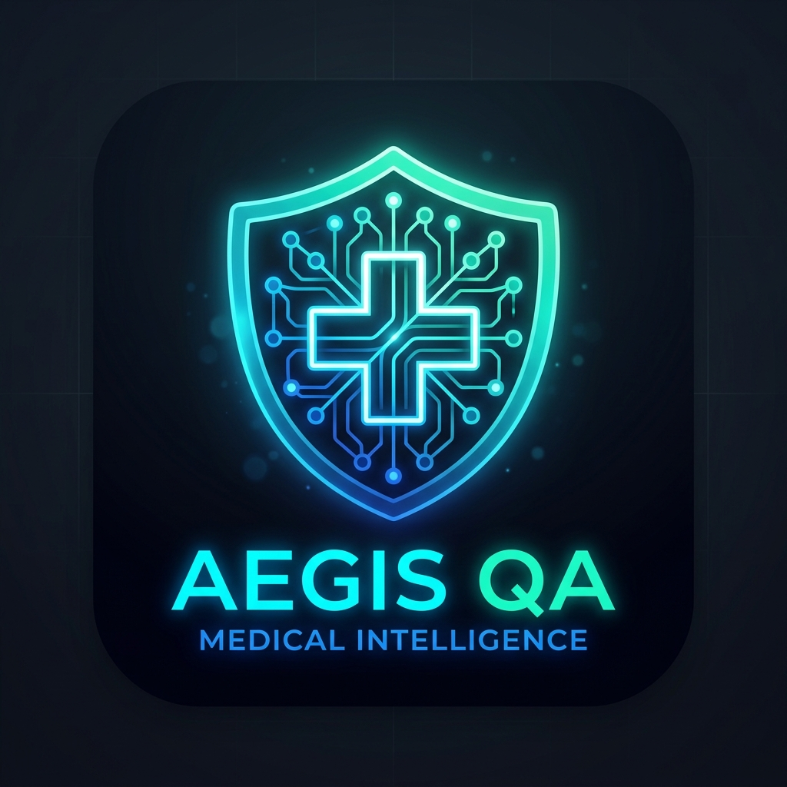
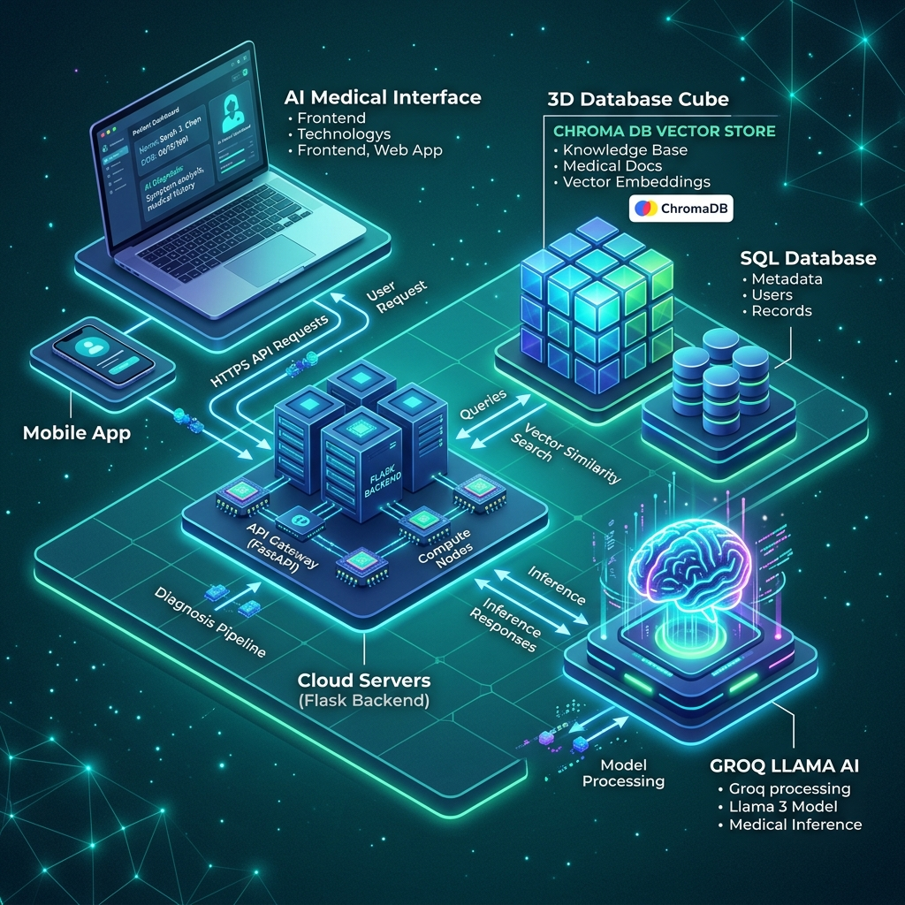
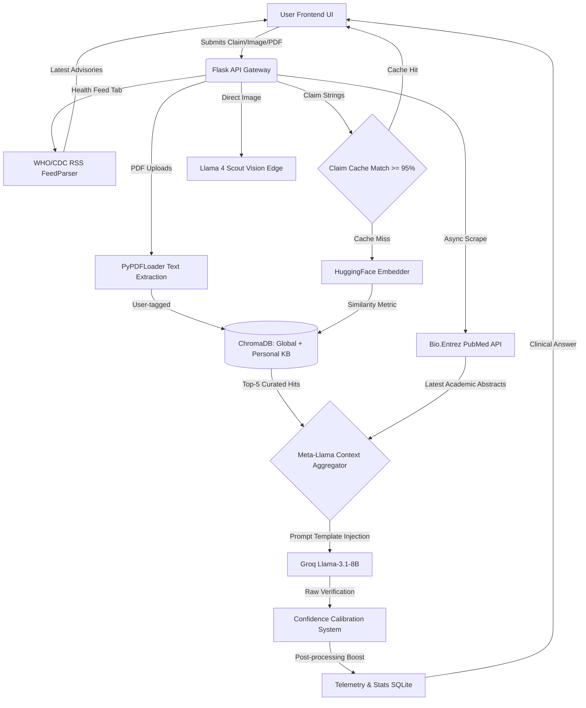

<div align="center">
  
  
  # Automated Fast Checking of Medical Information using LLM and Vector Search

  **Aegis Medical Intelligence**
  
  <p align="center">
    An enterprise-grade, full-stack AI application designed to rapidly verify medical claims, analyze clinical reports, and parse medical imagery using advanced Hybrid RAG (Retrieval-Augmented Generation) pipelines.
  </p>
  
   
  
  
  
</div>

<hr />

## 🌟 Introduction

In an era of medical misinformation, clinical analysts and everyday users need tools to cross-reference medical claims instantaneously against verified knowledge. **Aegis QA** eliminates the manual effort of deep-dive literature research by using **Vector Similarity Search**, live **PubMed** queries, and **Groq's Ultra-Fast Llama Models** to intelligently debunk, verify, and explain medical queries and documents.

Whether you're batch-processing a dozen claims, uploading a text-heavy PDF blood panel, or uploading a direct image of an MRI/X-Ray, Aegis outputs **Confidence Scores, Symptoms, Precautions, and a structured Medical Glossary** in milliseconds.

<br/>

## 📖 Project Explanation & Context

This system was developed as a comprehensive final project for a **Data Science Minor Degree**. It demonstrates an advanced, full-stack understanding of AI Agents, Retrieval-Augmented Generation (RAG) paradigms, and modern application development.

### ⚠️ The Problem Statement
The internet is oversaturated with unverified medical advice. The general public lacks access to validated clinical databases, and medical professionals spend countless hours manually cross-referencing patient records with recent literature. Existing generalized AI models (like ChatGPT) suffer from "hallucinations"—confidently inventing fake medical facts that could prove dangerous.

### 💡 The Solution
Aegis Medical Intelligence solves this by forcibly grounding the AI's logic strictly against factual medical frameworks. We discard the AI's "guessed" knowledge and instead force it to read live scientific research from the **NIH PubMed Database** and verified curated chunks housed in **ChromaDB**. 

### 🎯 Core Objectives
- **Data Engineering:** Build an autonomous pipeline that cleans, embeds (`HuggingFace`), and vectors medical texts into semantic space.
- **API Architecture:** Establish secure, ultra-low-latency bidirectional streaming between a React client and Python compute nodes.
- **Multimodal capabilities:** Provide simultaneous capacity to "read" text claims natively, parse clinical documents (PDFs), and interpret abstract visual features (MRIs/Scans).

<br/>

## 🛠️ Technology Stack

We specifically engineered the stack to prioritize maximum throughput, zero-latency inference, and a highly interactive, dynamic frontend:

| Area | Technologies Used | Description |
| :--- | :--- | :--- |
| **Frontend** | React, Vite, TailwindCSS, Framer Motion | A modern, glassmorphism-styled UI with micro-animations and dynamic layout tabs. |
| **Backend API** | Flask | Lightweight Python API serving strict REST endpoints to bridge logic and the ML models. |
| **LLM Inference** | Groq API (`meta-llama`), LangChain | **Text:** `llama-3.1-8b-instant`<br>**Vision:** `llama-4-scout-17b-instruct` |
| **Vector DB (RAG)** | ChromaDB | In-memory & locally persisted vector store for semantic similarity. |
| **Embeddings** | HuggingFace (`all-MiniLM-L6-v2`) | CPU-accelerated fast text embeddings. |
| **Live Consensus** | Bio.Entrez (PubMed API) | Scrapes globally verified medical abstract metadata live for consensus checks. |
| **Data Storage** | SQLite, SQLAlchemy | Stores user search history, analytics, and execution telemetry. |

<br/>

## 🏛️ System Architecture


<div align="center">
  
</div>
<br/>

### 🌊 Data Flow & Logic Map


### 📂 Project Folder Structure
```text
medical-fact-checker/
│
├── frontend/                  # React Application
│   ├── src/
│   │   ├── components/        # Dashboards, Charts, Verification UI
│   │   ├── api.js             # HTTP Hooks
│   │   └── index.css          # Tailwind & Micro-animations
│   └── package.json           # Vite Configuration
│
├── backend/                   # Python Flask Server
│   ├── app.py                 # REST Endpoints (/fact-check, /analyze-image)
│   ├── rag_engine.py          # AI Orchestration (LangChain, Groq, Chroma)
│   ├── chroma_db/             # Auto-persisted Vector Embeddings
│   └── instance/              # SQLite Database
│
├── assets/                    # Project Media
└── README.md                  # System Documentation
```

Our Hybrid-RAG pipeline is designed to fuse local knowledge with live external consensus:

1. **Query Ingestion & Caching:** The user uploads a claim or document. Before processing, the system checks the **ChromaDB Claim Cache**. Near-identical searches (>=95% similarity) return instantly.
2. **Document Processing:** 
    - Images are directly routed to the **Llama 4 Scout** multi-modal edge vision model via Groq.
    - PDF documents are chunked and linked directly to your **Personal Knowledge Base** via user profiles.
3. **Vector Semantic Search:** The query is embedded via `HuggingFace`. ChromaDB runs nearest-neighbor metrics to retrieve the top 5 highly relevant curated chunks from the generalized medical store AND your scoped personal doc records.
4. **Live Live Consensus:** The engine fires an asynchronous request to the NIH PubMed database to grab the most relevant live academic abstracts, alongside fetching live public health advisories from global **WHO/CDC RSS Feeds**.
5. **LLM Synthesis & Calibration:** The combined context is injected into a strict `PromptTemplate`. **Llama 3.1 8B** synthesizes the verdict. The result then moves through a **Confidence Calibration System** that adjusts the final confidence percentage based on strict verification floors and multi-source corroboration bonuses.
6. **Telemetry & Client Parsing:** Processing millisecond timing, validated verdicts, and confidence scores are pushed to SQLite for the Analytics Dashboard, and routed back to the premium Framer UI.

<br/>

## 🚀 Key Features

* **Single Fast Checking:** Instantly fact-check claims. View transparent pipeline visualizers showing exact Vector Search, PubMed, and LLM processing times.
* **Automated Batch Processing:** Paste a massive block of medical claims. The system will iterate through them and return a verified table.
* **Knowledge Base Explorer:** See exactly what medical topics (Cardiology, Immunology, Pharmacology) exist inside your Vector Store.
* **Multi-Modal Image & PDF Analysis:** Upload PDF reports or real image scans (`.jpg`, `.png`). The AI extracts detected symptoms, flags abnormal values, and lists explicit precautions.
* **Real-time Voice Synthesis:** Full Audio dictation of medical explanations using Web Speech APIs.
* **Claim Similarity Cache:** Near-identical claims return instantly from a ChromaDB cache with lightning-fast ~0ms latency.
* **Personal Knowledge Base:** Uploaded PDFs are tagged to your user profile, enabling vector searches routed against your own clinical documents.
* **Live WHO/CDC Health Feed:** Integrated RSS parsing dynamically fetches the latest medical advisories and health news directly from global health authorities.
* **Confidence Calibration System:** Advanced algorithmic confidence scoring combining base LLM certainty, vector similarity boosts, and multi-source corroboration metrics to ensure trustworthy verdicts.
* **Premium Physics UIs:** A fully redesigned, aesthetic frontend utilizing Framer Motion physics to deliver an engaging, fluid enterprise user experience.

<br/>

## ⚙️ Execution & Setup Steps

Follow these instructions to run the application fully locally.

### 1. Clone the Repository
```bash
git clone <repository_url>
cd medical-fact-checker
```

### 2. Backend Setup
Navigate to the backend, set up a virtual environment, and install dependencies:
```bash
cd backend
python -m venv venv
source venv/bin/activate  # On Windows: venv\\Scripts\\activate
pip install -r requirements.txt
```

**Environment Variables:**
Create a `.env` file in the `backend/` directory:
```env
GROQ_API_KEY=your_groq_api_key_here
PUBMED_EMAIL=your_email@example.com
```
*Note: Make sure to get your free API key from [Groq Console](https://console.groq.com/keys).*

**Start the Backend Server:**
```bash
python app.py
```
*(The backend runs on `http://127.0.0.1:5001`. On first load, it will auto-download the HuggingFace embeddings and pre-seed the Chroma database with 34 diverse medical facts).*

### 3. Frontend Setup
Open a new terminal window and navigate to the frontend directory:
```bash
cd frontend
npm install
```

**Start the Frontend Server:**
```bash
npm run dev
```

### 4. Experience the Platform
Navigate to **`http://localhost:5173`** in your browser. 
Create an account on the landing page, sign in, and you will arrive at the main Aegis QA Medical Intelligence Dashboard!

<br/>

---

<p align="center">
  <i>Developed for Automated Fast Checking of Medical Information using LLM and Vector Search.</i>
</p>
